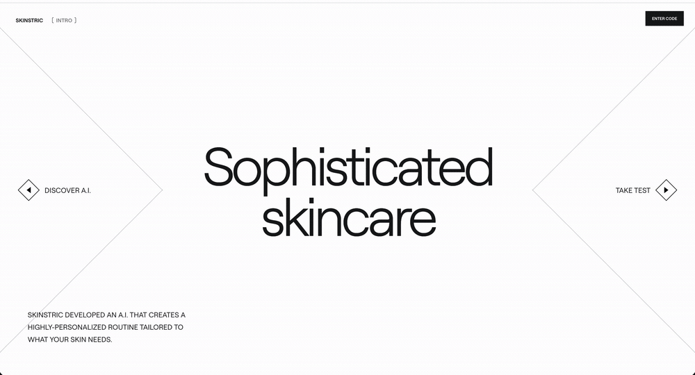

# Skinstric

[](https://github.com/mleahy79/skinstric-internship/actions/workflows/ci.yml)

A pixel-accurate rebuild of the Skinstric product flow, from landing page to AI-generated skin
demographics.



**Live:** <https://skinstric-internship-eight.vercel.app>

**Stack:** Next.js 16 (App Router) · React 19 · TypeScript · Tailwind CSS 4 · Framer Motion ·
Zustand · Vitest

**Lighthouse:** [99 / 96 / 100 / 100](#lighthouse) — Performance / Accessibility / Best
Practices / SEO

A hero landing page, an onboarding questionnaire, a selfie capture/upload step, and an analysis
screen that returns confidence-scored predictions the user can review and override.

## Flow

1. **Landing (`/`)** — hero screen with "Discover A.I." / "Take Test" entry points.
2. **Onboarding** — name and location text steps, validated and persisted to `localStorage`
   via a Zustand store, then submitted to the Phase One API.
3. **Selfie (`/selfie`)** — capture a photo with the device camera or upload one from the
   gallery.
4. **Analysis (`/analysis`, `/analysis/demographics`)** — the photo is submitted to the Phase
   Two API, which returns confidence-scored predictions (race, age, gender) that the user can
   review and override.

## Getting Started

```bash
npm install
npm run dev
```

Open [http://localhost:3000](http://localhost:3000) to view the app. Edit `app/page.tsx` to
start changing the landing page — pages hot-reload as you edit.

`npm run build` produces a production build; `npm run lint` runs ESLint.

## Testing

Unit and component tests run on [Vitest](https://vitest.dev) + [React Testing
Library](https://testing-library.com/react), with jsdom as the DOM environment. Config lives in
[vitest.config.mts](vitest.config.mts) and [vitest.setup.ts](vitest.setup.ts). Test files sit
next to the code they cover (`*.test.ts` / `*.test.tsx`):

- `store/onboarding.test.ts`, `store/analysis.test.ts` — Zustand store state transitions
- `components/phase-one/TextStep.test.tsx` — name/location input validation and submit gating
- `components/analysis/ProgressCircle.test.tsx` — percentage-to-arc rendering

Run them with `npm test`, or `npm run test:watch` to re-run on change.

## Lighthouse

Latest run against the deployed build: **Performance 99, Accessibility 96, Best Practices 100,
SEO 100.**

The one flagged item is a contrast warning on the `#A0A4AB` uppercase micro-labels (e.g. "Click
to type", "To start analysis") against a white background. Left as-is deliberately — the color
is a pixel-accurate match to the Figma spec, and darkening it to satisfy WCAG AA would break
design fidelity for a label style that's decorative/secondary rather than primary content.

## Backend

The app talks to two external Firebase Cloud Functions (no local API routes):

- **Phase One** — `POST` name/location to kick off analysis.
- **Phase Two** — `POST` the captured/uploaded photo to get demographic predictions.

Endpoint URLs are defined inline in [app/page.tsx](app/page.tsx) and
[app/selfie/page.tsx](app/selfie/page.tsx).

<details>
<summary><strong>Project structure</strong></summary>

```
app/
  page.tsx                 landing / onboarding entry
  selfie/                  camera capture + photo upload
  analysis/                demographics results
components/
  phase-one/               onboarding UI (text steps, processing screen)
  analysis/                results UI (progress circle, etc.)
  Nav.tsx
store/
  onboarding.ts            name/location (persisted)
  analysis.ts              photo + demographics results, user overrides
fonts/                     self-hosted Roobert font
public/                    SVG assets from Figma
docs/                      README media
```

</details>
